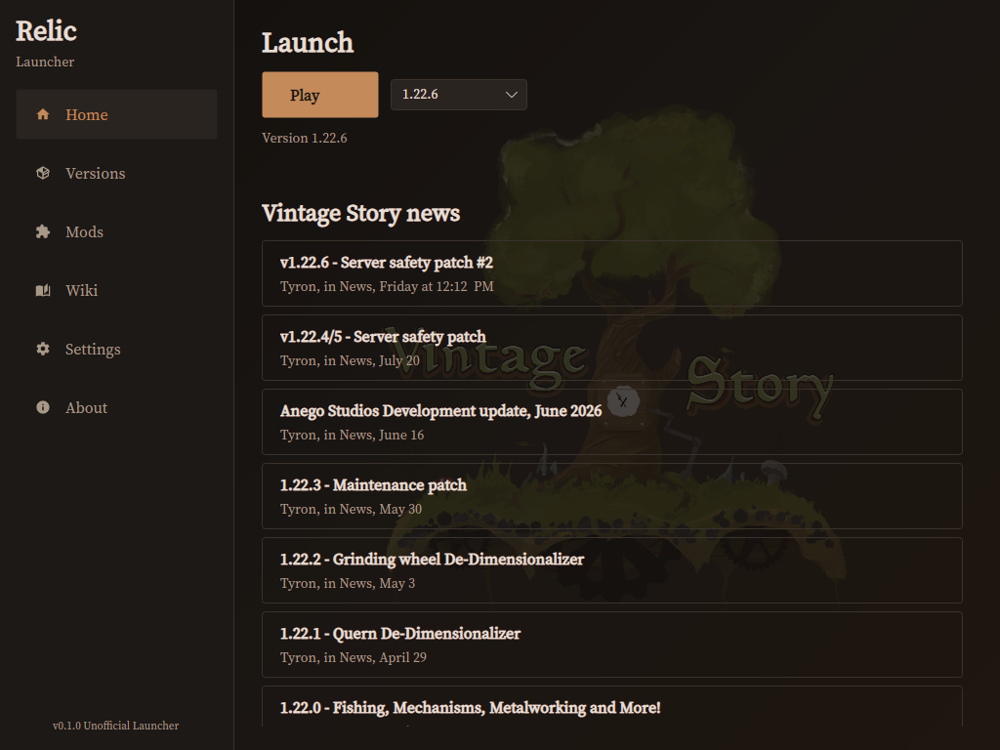

# Relic Launcher

**Unofficial** desktop launcher for [Vintage Story](https://www.vintagestory.at/). Relic Launcher and SmelterWorks is not affiliated with Anego Studios.

Built with C# / .NET 10 and Avalonia 12.1. Targets the same desktop platforms Vintage Story supports: Windows 10+ x64, Linux x64 (X11 and native Wayland), and macOS 13+ (x64 and arm64).



## Features

- Sign in with your Vintage Story account
- Install multiple game versions
- Browse official ModDB and install/manage mods.
- Local mods support
- Optional warning when a mod is on the official blocked-mods list
- One-click play with mods, saves, and worlds kept in one shared folder
- Sign in once in the launcher, no second login screen in-game
- Backup and restore mods, worlds, and installed game versions as a single zip
- Game news, custom themes, and support for Windows, Linux, and macOS
- In-app Vintage Story wiki browser (domain locked, URL configurable in Settings)

## Upcoming

- Launcher sandboxing (the app itself, not the game)
- Server Hosting
- Custom fonts support
- i18n - multi-language support

> [!NOTE]
> Development is human-maintained. We use OpenCode with open-weight models as an editing aid. Every change is reviewed by a human before merge and must pass the project tests. Contributors own any AI-assisted patches they submit.

## Requirements

- .NET 10 SDK to build from source
- Release and nightly downloads are **self-contained** (no separate .NET Desktop Runtime install)
- Wiki page uses the platform webview: [WebView2](https://developer.microsoft.com/microsoft-edge/webview2/) on Windows, WPE WebKit (`wpewebkit`) on Linux, WKWebView on macOS. If the embed is missing, use **Open in browser**.

## Build and run

```bash
dotnet restore RelicLauncher.sln
dotnet build RelicLauncher.sln -c Release

dotnet run --project src/RelicLauncher.App/RelicLauncher.App.csproj
```

Tests:

```bash
dotnet test RelicLauncher.sln -c Release
```

Mutation tests (Stryker.NET, validates test quality):

```bash
dotnet tool restore

dotnet stryker --config-file stryker.core.json
dotnet stryker --config-file stryker.infrastructure.json
```

Uses `RelicLauncher.Mutation.sln` (Core and Infrastructure only, no Avalonia UI projects).

Format check:

```bash
dotnet format RelicLauncher.sln --verify-no-changes
```

## Publish RIDs

Self-contained publishes (what CI/release use):

```bash
dotnet publish src/RelicLauncher.App/RelicLauncher.App.csproj -c Release -r win-x64 --self-contained true -p:PublishSingleFile=false -o artifacts/win-x64
dotnet publish src/RelicLauncher.App/RelicLauncher.App.csproj -c Release -r win-x64 --self-contained true -p:PublishSingleFile=true -o artifacts/win-x64-portable

chmod +x packaging/windows/build-packages.sh
packaging/windows/build-packages.sh --version 0.1.0 --publish-dir artifacts/win-x64 --portable-dir artifacts/win-x64-portable --output-dir .

dotnet publish src/RelicLauncher.App/RelicLauncher.App.csproj -c Release -r linux-x64 --self-contained true -p:PublishSingleFile=false -o artifacts/linux-x64

dotnet publish src/RelicLauncher.App/RelicLauncher.App.csproj -c Release -r osx-x64 --self-contained true -p:PublishSingleFile=false -o artifacts/osx-x64
dotnet publish src/RelicLauncher.App/RelicLauncher.App.csproj -c Release -r osx-arm64 --self-contained true -p:PublishSingleFile=false -o artifacts/osx-arm64
```

Release artifacts:

- Windows: `relic-launcher-{version}-win-x64.zip` (folder), `relic-launcher-{version}-win-x64-portable.zip` (single exe), `relic-launcher-{version}-win-x64-setup.exe` (NSIS installer)
- macOS: `relic-launcher-{version}-osx-*.app.zip` (`Relic Launcher.app`, not notarized)
- Linux: deb, rpm, Arch pkg, AppImage, and Flatpak via `packaging/linux/build-packages.sh`

### Flatpak (Linux)

Download `relic-launcher-{version}-linux-x64.flatpak` from GitHub Releases or nightlies, then:

```bash
flatpak install --user relic-launcher-{version}-linux-x64.flatpak
flatpak run com.smelterworks.RelicLauncher
```

The Flatpak runs Relic and Vintage Story inside the sandbox. Launcher settings, game installs, saves, and mods use the app sandbox XDG directories (under `~/.var/app/com.smelterworks.RelicLauncher/`), not your host `~/.config/VintagestoryData` or `~/Games` unless you pick a host folder through a file picker.

To build the Flatpak locally after a `linux-x64` publish:

```bash
chmod +x packaging/linux/build-packages.sh
packaging/linux/build-packages.sh \
  --version 0.1.0 \
  --publish-dir artifacts/linux-x64 \
  --output-dir artifacts/packages
```

Requires `flatpak` and `flatpak-builder` with the Freedesktop 24.08 Platform and Sdk from Flathub. Pass `--skip-flatpak` to build only deb, rpm, Arch pkg, and AppImage.

## Config and logs

App data root:

- Windows: `%AppData%/RelicLauncher`
- Linux / macOS: `~/.config/RelicLauncher` (via `ApplicationData`)
- Flatpak: `~/.var/app/com.smelterworks.RelicLauncher/config/RelicLauncher`

Files:

- `settings.json` theme, installs root, selected version, data path, exit confirm
- `logs/relic-YYYYMMDD.log`
- `cache/` downloads and news cache
- `secrets/` platform-protected account session
- `themes/` reserved for user theme packs

## Themes

Built-in packs live in `src/RelicLauncher.Themes/Themes/`. Controls bind to keys such as `Theme.Bg0`, `Theme.Accent`, and `Theme.Text`. Switch themes in Settings. Live apply swaps the merged resource dictionary.

To add a built-in pack: create an `.axaml` resource dictionary with the same keys, register it in `BuiltInThemeCatalog`, and rebuild.

## Project map

| Project | Role |
|---|---|
| `RelicLauncher.Core` | Models and interfaces. No Avalonia, no IO |
| `RelicLauncher.Infrastructure` | Settings, logging, process runner, stubs |
| `RelicLauncher.Themes` | Built-in theme resources |
| `RelicLauncher.App` | Avalonia UI, DI composition, exception bridge |

## Contributing

See [CONTRIBUTING.md](CONTRIBUTING.md). Contact: team [at] smelterworks.com for launcher questions.

## Security

See [SECURITY.md](SECURITY.md) and [NOTICE](NOTICE).

## License

0BSD. See [LICENSE](LICENSE).
